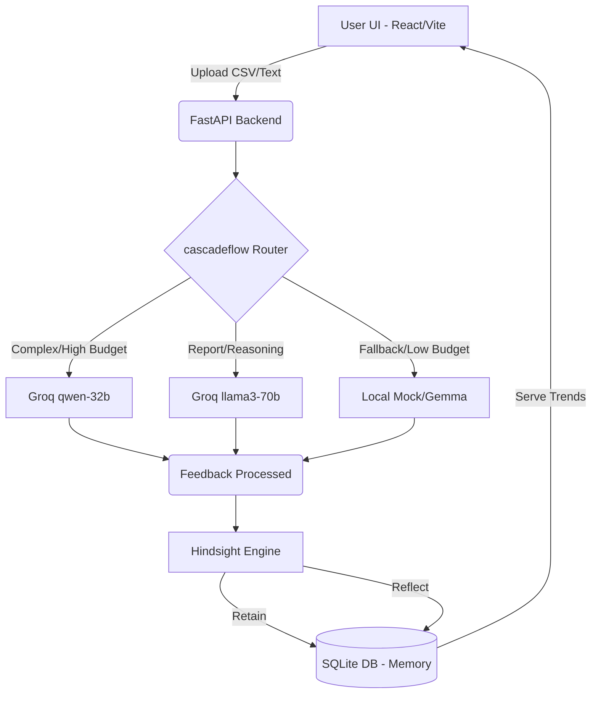

# ProductPulse AI
> Memory-Powered Customer Feedback Intelligence Agent

ProductPulse AI is a hackathon-winning SaaS application that ingests customer feedback and extracts deep, actionable insights using two proprietary core technologies:
1. **Hindsight Engine**: Retains, Recalls, and Reflects on historical feedback to detect emerging trends over time (e.g., "Checkout issues have increased by 100%").
2. **cascadeflow Engine**: A runtime intelligence module that routes LLM requests intelligently based on budget and complexity, enforcing cost controls and providing a comprehensive audit trail.

## 🚀 Architecture Diagram



## 🛠 Tech Stack
- **Frontend**: React 18, Vite, TypeScript, Tailwind CSS v4, Recharts, Framer Motion
- **Backend**: FastAPI, Python, SQLAlchemy, SQLite
- **AI Models**: Groq (Qwen/Llama3) integrated via custom `cascadeflow` routing.

## 🏃‍♂️ Getting Started

### 1. Environment Variables
Create a `.env` file in the `backend/` directory:
```env
GROQ_API_KEY=your_groq_api_key_here
CASCADEFLOW_BUDGET=5.00
DATABASE_URL=sqlite:///./productpulse.db
```

### 2. Backend Setup
```bash
cd backend
python -m venv venv
# Activate venv: source venv/bin/activate OR .\venv\Scripts\Activate.ps1
pip install -r requirements.txt # (or install dependencies manually if missing)
python main.py
```
*Note: SQLite tables will be created automatically on startup.*

### 3. Frontend Setup
```bash
cd frontend
npm install
npm run dev
```

## 🎥 Judge Demo Script

1. **Introduction**: "Welcome to ProductPulse AI. Companies drown in feedback but miss the big picture over time. We solve this with two core innovations: Hindsight and cascadeflow."
2. **Upload Batch 1**: Navigate to Upload. Upload `feedback_batch_1.csv`.
3. **Show Dashboard**: "Our AI instantly categorized sentiment and extracted top complaints like 'checkout issues'."
4. **Demonstrate cascadeflow**: Go to the *cascadeflow Runtime* tab. "Here is our runtime intelligence. It intelligently routed the task to the most cost-effective Groq model and logged the exact latency and cost. If our budget dropped, it would fallback seamlessly."
5. **Demonstrate Hindsight**: Upload `feedback_batch_2.csv`. Go to the *Hindsight Memory* tab. "This is where the magic happens. The AI remembered Batch 1, compared it to Batch 2, and generated a reflection trend: 'Checkout complaints have increased'. It provides persistent temporal awareness."
6. **Executive Report**: Go to Reports. Click Export PDF. "Finally, a strategic report is generated for executives, ready to be exported."

## ☁️ Deployment Instructions

### Vercel (Frontend)
1. Push your repository to GitHub.
2. Import the `frontend` folder into Vercel.
3. Set the Build Command to `npm run build` and Output Directory to `dist`.
4. Add environment variable `VITE_API_URL` pointing to your deployed backend (update `api.ts` to use it).

### Render (Backend)
1. Create a New Web Service on Render, connected to your GitHub repo.
2. Set the Root Directory to `backend`.
3. Build Command: `pip install -r requirements.txt` (Make sure to generate a `requirements.txt` from pip freeze).
4. Start Command: `uvicorn main:app --host 0.0.0.0 --port $PORT`
5. Add `GROQ_API_KEY` to the environment variables.

## 📸 Screenshots Required List
Before submitting to Devpost/Hackathon platform, capture:
1. Dashboard showing the beautiful dark-mode charts.
2. Upload Page during processing.
3. cascadeflow Runtime page showing the audit table and budget stats.
4. Hindsight Memory Timeline showing sequential batch reflections.
5. Executive Report view.

## 🔗 LinkedIn Description
"Thrilled to unveil ProductPulse AI! 🚀 Built during [Hackathon Name], we tackled the problem of lost customer feedback context. We engineered 'Hindsight' for persistent memory across datasets and 'cascadeflow' for intelligent, budget-aware LLM routing using Groq. From raw CSV to executive PDFs in seconds. Proud of this complete SaaS implementation! #AI #Hackathon #Groq"

## ✅ Testing Checklist (Pre-deployment)
- [x] Verify API routes (FastAPI Swagger at `/docs`).
- [x] Verify frontend-backend integration.
- [x] Test Hindsight memory generation (needs 2 batches uploaded).
- [x] Verify cascadeflow audit logs populate correctly.
- [x] Verify Recharts render accurately based on feedback counts.
- [x] Test responsive design on mobile view.
