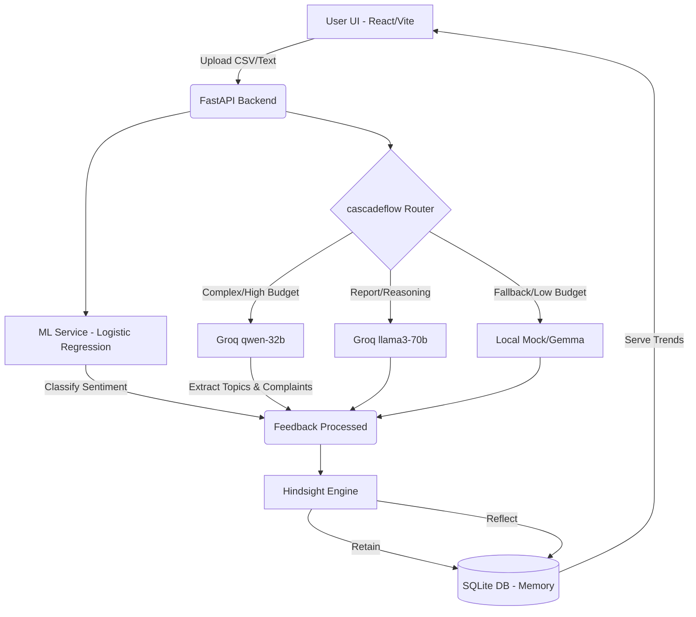

# ProductPulse AI
> Memory-Powered Customer Feedback Intelligence Agent

**Live Demo**: [https://customer-feedback-analytics-ai.vercel.app](https://customer-feedback-analytics-ai.vercel.app)
**Backend API**: [https://customer-feedback-analytics-ai.onrender.com](https://customer-feedback-analytics-ai.onrender.com)

ProductPulse AI is a complete Data Science + AI SaaS application that ingests customer feedback and extracts deep, actionable insights. This project demonstrates a production-quality machine learning pipeline combined with advanced LLM routing.

## 🚀 Architecture Diagram



## 🧠 Data Science & Machine Learning Pipeline
This project features a fully reproducible NLP Machine Learning pipeline trained on the **Amazon Customer Reviews** dataset.
The pipeline is documented in the `notebooks/` directory:
1. **`01_data_cleaning.ipynb`**: Downloads the real dataset, handles missing values, removes duplicates, and standardizes text.
2. **`02_nlp_preprocessing.ipynb`**: Tokenization, stopword removal, and lemmatization using NLTK. (This exact pipeline is reused in the production backend).
3. **`03_eda.ipynb`**: Exploratory Data Analysis with visualizations for sentiment distribution, review lengths, and frequent terms.
4. **`04_model_training.ipynb`**: Trains a robust **Logistic Regression** model on **TF-IDF** features. The trained artifacts (`tfidf_vectorizer.joblib` and `sentiment_model.joblib`) are persisted in the `models/` directory for real-time inference.

**AI Business Intelligence Layer**: While the ML model efficiently classifies sentiment, the LLM (`cascadeflow`) is reserved strictly for high-level semantic tasks: extracting topics, detecting complaints/feature requests, and generating executive summaries. This hybrid architecture drastically reduces API costs and latency.

## 🛠 Tech Stack
- **Data Science**: Python, Pandas, Scikit-learn, NLTK, Matplotlib, Seaborn
- **Frontend**: React 18, Vite, TypeScript, Tailwind CSS v4, Recharts, Framer Motion
- **Backend**: FastAPI, Python, SQLAlchemy, SQLite
- **AI Models**: Groq (Qwen/Llama3) integrated via custom `cascadeflow` routing.

## 🏃‍♂️ Getting Started

### 1. Environment Variables
Create a `.env` file in the `backend/` directory:
```env
GROQ_API_KEY=your_groq_api_key_here
CASCADEFLOW_BUDGET=5.00
DATABASE_URL=sqlite:///./productpulse.db
```

### 2. Backend Setup
```bash
cd backend
python -m venv venv
# Activate venv: source venv/bin/activate OR .\venv\Scripts\Activate.ps1
pip install -r requirements.txt
python main.py
```
*Note: Ensure you have run the notebooks or the pipeline script to generate the models in the `models/` directory before starting the backend.*

### 3. Frontend Setup
```bash
cd frontend
npm install
npm run dev
```

## ☁️ Deployment Instructions

### Vercel (Frontend)
1. Push your repository to GitHub.
2. Import the `frontend` folder into Vercel.
3. Set the Build Command to `npm run build` and Output Directory to `dist`.
4. Add environment variable `VITE_API_URL` pointing to your deployed backend (update `api.ts` to use it).

### Render (Backend)
1. Create a New Web Service on Render, connected to your GitHub repo.
2. Set the Root Directory to `backend`.
3. Build Command: `pip install -r requirements.txt`
4. Start Command: `uvicorn main:app --host 0.0.0.0 --port $PORT`
5. Add `GROQ_API_KEY` to the environment variables.

## ✅ Testing Checklist (Pre-deployment)
- [x] Verify API routes (FastAPI Swagger at `/docs`).
- [x] Verify frontend-backend integration.
- [x] Test Hindsight memory generation (needs 2 batches uploaded).
- [x] Verify cascadeflow audit logs populate correctly.
- [x] Verify Recharts render accurately based on feedback counts.
- [x] Test responsive design on mobile view.
